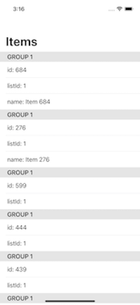
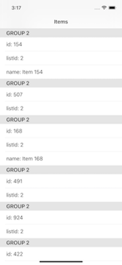

# FetchRewards
iOS App: Coding exercise for Fetch Rewards.

Note: To make the project buildable on the latest (non-pre release) tools and supporting the current release mobile OS, SwiftUI with a target of iOS14 was selected.

___

## Built with:
* Swift
* SwiftUI
* SwiftyJSON
* MVP
